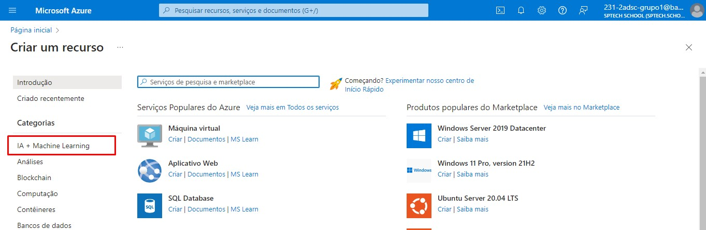

# Análise de Linguagem no Language Studio

1. Acesse a página inicial da azure no link: https://portal.azure.com, e clique em "Criar um recurso".

 

2. No menu de opções na lateral esquerda, clique em "IA + Machine Learning".

 

3. Na opção "Análise de Texto" clique em "Criar".

 

4. Na tela "Select additional features" clique em "Continue to create your resourse"

 

5. Em "Detalhes do projeto", não altere a opção de assinatura. Em "Grupo de recursos" escolha um já criado ou crie um novo no botão abaixo "Criar novo".

 

6. Descendo a tela, temos os detalhes da instância, é recomendado não utilizar servidores da região do Brasil, por questões de instabilidade, aqui utilize a já indicada pela Azure ou "East US". Em "Nome" coloque um nome de sua preferência. Em "Tipo de preço" escolha a opção "Free F0". E confirme a checkbox abaixo sobre os termos de uso.

 

7. Revise tudo e clique no botão "Examinar + criar" na lateral inferior esquerda

 

8. Você será redirecionado a outra página com os termos, clique em "Criar" na lateral inferior esquerda

 

9. Após ser redirecionado, deve aparecer um card de exito. Acesse: https://language.cognitive.azure.com. (Talvez seja necessário refazer o login de sua conta)

 

10. Ao acessar o Language Studio, deve aparecer um formulário para a identificação do recurso. Mantenha o diretório que ele já identificou, selecione sua assinatura padrão e mantenha a opção "Language". Em "Resource Name" escolha o recurso criado.

 

11. Na tela inicial do Language Studio, vá até a seção "Classify text". 

 

12. Clique no card "Analyze sentiment and mine opinions"

 

13. Selecione a linguagem do texto que irá colocar e mantenha o recurso da linguagem selecionado.

 

14. É possível colocar um texto na caixa maior de escrita, subir um arquivo de texto, ou escolher entre alguns dos templates já pré selecionados pela Azure.

 

15. Coloque o texto que deseja testar, marque a chckbox de utilização de recursos e clique em "Run".

 

16. Abaixo ele gera o resultado da análise na seção "Result", e separa uma análise individual para cada uma das sentenças identificadas.

 

17. Na seção "JSON" ele coloca o código da análise em JSON.

 